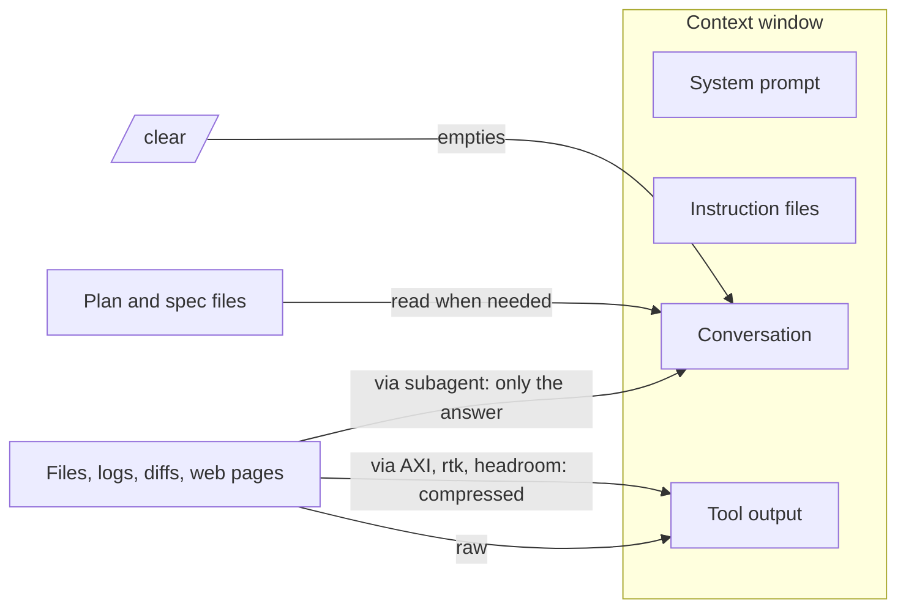

# Token maxing

"Token maxing" is our shorthand for getting the most useful work out of every token in the context window.

The context window is everything the model can see: system prompt, instruction files, your messages, and every tool result. It is finite, and quality degrades well before it is full. Managing it is the difference between an agent that finishes a task and one that loses the thread halfway through.

For a feel of how this plays out in a real session, watch the [interactive context window timeline](https://code.claude.com/docs/en/context-window) in the Claude Code docs. It replays a session from startup to compaction with token counts for each step, so you see what loads before you type, what each file read and hook adds, and how a subagent keeps large reads out of your window.

## Rule 1: `/clear` between tasks

The single most effective habit. Start every new task with an empty conversation. If something from the previous task matters, it belongs in a file, a commit message, or the instruction file, not in the conversation.

Run `/context` at any time to see how full the window is and what is in it.

## Rule 2: keep instruction files short

Instruction files are loaded on every turn. Two hundred lines of `CLAUDE.md` is two hundred lines the model re-reads each time. See [instruction files](../concepts/instruction-files.md) for what to keep and what to move into skills or path-scoped rules.

## Rule 3: keep tool output out of the window

Most context is consumed by tool results, not by your prompts. Three ways to cut it:

### Subagents

Delegate anything that reads many files or produces long output to a subagent. Only its final answer enters the parent's context.

### Agent-friendly CLIs: AXI

[AXI](https://axi.md/) (Agent eXperience Interface) is a set of design principles for command-line tools built for agents: token-efficient, structured output, discoverable with one command. The official tools:

| Tool | Purpose | Try it |
|------|---------|--------|
| `gh-axi` | GitHub issues, PRs, workflows | `npx -y gh-axi` |
| `chrome-devtools-axi` | Browser automation with combined operations | `npx -y chrome-devtools-axi` |
| `lavish-axi` | Human review surfaces for agent-generated HTML | see [orchestration](../concepts/orchestration.md) |
| `quota-axi` | Local Claude, Copilot and Cursor quota tracking | `npx -y quota-axi` |

Prefer an AXI tool over an MCP server when one exists: the output is smaller and the tool description costs fewer tokens.

### Output compression

- [rtk](https://github.com/rtk-ai/rtk) (Rust Token Killer) is a proxy that filters and compresses the output of 100+ common shell commands before it reaches the model, reportedly by up to 90 percent. Install, run `rtk init -g`, and it rewrites commands transparently.
- [headroom](https://github.com/headroomlabs-ai/headroom) compresses tool outputs, logs and files before they reach the model, typically saving 20 to 60 percent of tokens. `pip install "headroom-ai[all]"` then `headroom wrap claude` or run it as a local proxy.

Both are under evaluation. Try one, measure with `/context`, and report back.

## Rule 4: compact data formats

When you pass structured data to the model, JSON is verbose. [TOON](https://toonformat.dev/) (Token-Oriented Object Notation) encodes the same data model with indentation instead of braces and minimal quoting. Benchmarks report roughly 40 percent fewer tokens at the same retrieval accuracy. Use it for tables and records you hand to the agent in bulk.

## Rule 5: terse responses when you do not need prose

The [caveman](../concepts/skills.md#caveman) skill strips filler from agent responses while keeping code, commands and errors. On long sessions this adds up. Turn it on when you are working, off when you are writing documentation.

## Rule 6: plan in files, not in chat

A plan that lives in `docs/superpowers/plans/` survives `/clear`, compaction and hand-off. A plan that lives in the conversation is gone the moment you reset. Ask the agent to update the plan file as it goes.

## What compaction keeps

When the window fills, the harness summarises older turns. The project-root `CLAUDE.md` is re-read from disk afterwards; instructions given only in conversation may be lost. If something must survive, put it in a file.

## Further reading

The official guide on [reducing token usage](https://code.claude.com/docs/en/costs#reduce-token-usage) covers the same ground from the vendor side and adds levers this page does not: picking the model per task, tuning extended thinking, cutting MCP server overhead, and code intelligence plugins for typed languages. Its sections on moving `CLAUDE.md` content into skills and delegating verbose work to subagents are the official version of rules 2 and 3.

## Checklist

- [ ] `/clear` at the start of each task
- [ ] `/context` checked when the agent starts to drift
- [ ] Instruction files under 200 lines
- [ ] Long searches and reviews delegated to subagents
- [ ] AXI CLIs preferred over MCP for GitHub and browser
- [ ] Plans and specs written to files
