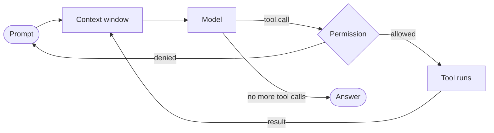

# Harnesses

A **harness** is the program that runs the agent loop: it sends your prompt and the conversation to a model, executes the tool calls the model asks for (read a file, run a command, edit a file), feeds the results back, and repeats until the model stops. The model decides *what* to do; the harness decides *what it is allowed to do* and *what it sees*.

Everything else on this site (instruction files, skills, orchestration) plugs into a harness. Choosing and configuring the harness is therefore the first decision.



## Harnesses we use

| Harness | Vendor / model | Docs | Notes |
|---------|----------------|------|-------|
| **Claude Code** | Anthropic, Claude models | [code.claude.com](https://code.claude.com/docs/en/setup) | Our default. Plugins, skills, hooks, subagents, worktrees. |
| **Codex CLI** | OpenAI, GPT models | [Codex CLI](https://learn.chatgpt.com/docs/codex/cli#getting-started) | Used for second opinions and comparison. |
| **OpenCode** | Open source, any model | [opencode.ai](https://opencode.ai/) | Provider-agnostic terminal agent. |
| **pi** | Open source | [pi.dev](https://pi.dev/docs/latest) | Minimal, scriptable harness. |

All four read a project-level instruction file. Claude Code reads `CLAUDE.md`, the others read `AGENTS.md`. Keeping one file and symlinking the other is how we avoid drift (see [instruction files](instruction-files.md)).

## Installing

=== "Claude Code"

    ```bash
    curl -fsSL https://claude.ai/install.sh | bash
    ```

=== "Codex CLI"

    ```bash
    curl -fsSL https://chatgpt.com/codex/install.sh | sh
    ```

=== "OpenCode and pi"

    Follow the install instructions at [opencode.ai](https://opencode.ai/) and [pi.dev](https://pi.dev/docs/latest).

## What a harness gives you

Different harnesses expose the same ideas under different names. The concepts that matter:

**Tools**
:   The actions the model may take: read, write, edit, bash, web fetch, and anything added by MCP servers or plugins. Fewer, well-described tools beat many vague ones.

**Permissions**
:   Which tool calls run without asking. Start strict, then use `/fewer-permission-prompts` style tooling to allow the read-only calls you see every day.

**Context window**
:   Everything the model sees: system prompt, instruction files, the conversation, and tool output. It is finite and it fills up fast. See [token maxing](../best-practices/context-management.md).

**Hooks**
:   Shell commands the harness runs at fixed points (before a tool call, after an edit, on stop). Use hooks for things that *must* happen, such as running a formatter. Instruction files only *ask* the model; hooks *enforce*.

**Subagents**
:   Fresh agent loops the main agent can spawn for a bounded task. Their tool output stays out of the parent's context. This is the basic unit of [orchestration](orchestration.md).

**Plugins and skills**
:   Packaged instructions, commands and agents that load on demand. See [skills](skills.md).

## Claude Code specifics worth knowing

- `/init` generates a first `CLAUDE.md` from the codebase.
- `/context` shows what is loaded and how much of the window is used.
- `/clear` resets the conversation. Use it between tasks.
- `/memory` opens the instruction and auto-memory files.
- `/plugin install <name>` installs a plugin from a marketplace.
- Plan mode lets the agent read and design without editing anything.

## Choosing between harnesses

Use Claude Code by default. Reach for a second harness when:

- you want an independent review of a design or a diff from a different model,
- a task is blocked on a model-specific weakness and you want to compare,
- you are evaluating a new model release.

Because instruction files and most skills are plain markdown, switching costs almost nothing. The investment in `AGENTS.md` and skills carries over.
