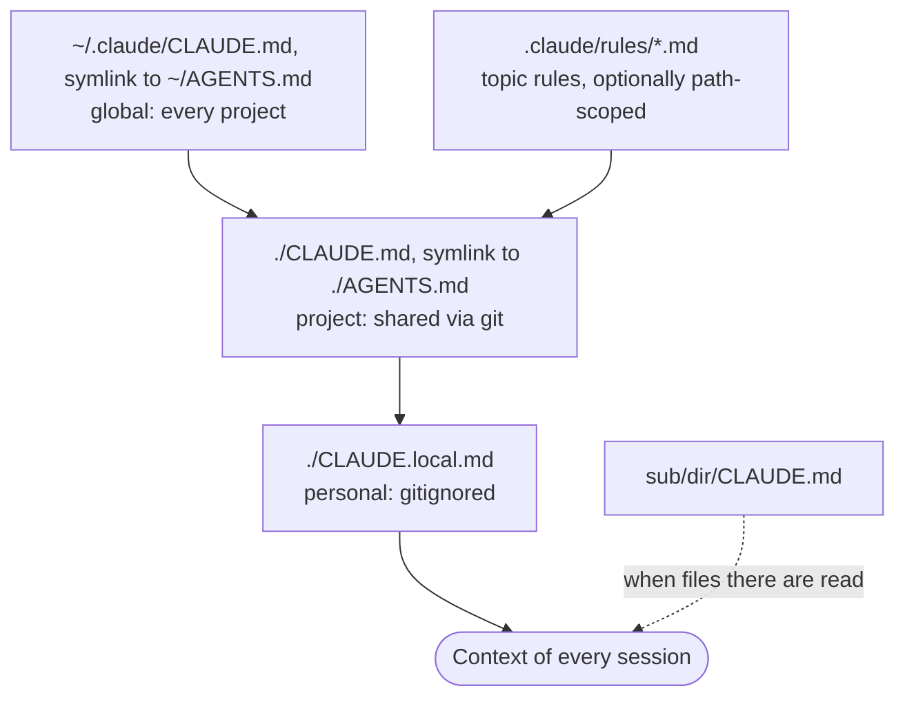

# CLAUDE.md and AGENTS.md

Instruction files are the persistent memory you write for the agent. They are loaded at the start of every session and are the single most effective lever you have on agent behaviour. Prompts are for the task at hand; instruction files are for everything you would otherwise repeat.

## One file, two names

Claude Code reads `CLAUDE.md`. Codex, OpenCode, pi and most other harnesses read `AGENTS.md`. We keep **`AGENTS.md` as the source of truth** and symlink it:

=== "Global (all projects)"

    ```bash
    ln -s ~/AGENTS.md ~/.claude/CLAUDE.md
    ```

=== "Per project"

    ```bash
    ln -s AGENTS.md CLAUDE.md
    ```

=== "Claude-specific additions"

    If you need Claude-only instructions, import instead of symlinking:

    ```markdown title="CLAUDE.md"
    @AGENTS.md

    ## Claude Code
    Use plan mode for changes under `src/billing/`.
    ```

Confirm the file is loaded by running `/context` in a session and checking **Memory files**.

## Where files live and what goes where

| Scope | Location | Put here | Shared with |
|-------|----------|----------|-------------|
| Global | `~/.claude/CLAUDE.md` (symlink to `~/AGENTS.md`) | Personal style rules, quality bar, commit conventions | Just you, all projects |
| Project | `./CLAUDE.md` (symlink to `./AGENTS.md`) | Build and test commands, layout, architecture decisions, project conventions | Team, via git |
| Local | `./CLAUDE.local.md` (gitignored) | Sandbox URLs, personal test data, experiments | Just you, this project |
| Rules | `.claude/rules/*.md` | Topic-specific rules, optionally scoped to file paths | Team, via git |

Files are concatenated, not overridden: global loads first, then project, then local. Nested `CLAUDE.md` files in subdirectories load when the agent reads files there.



## Our global template

This is the global `~/AGENTS.md` we start from. Copy it, then edit it as you learn what your agents get wrong.

```markdown title="~/AGENTS.md"
# Agent instructions

These are common instructions for my agents across all scenarios.

## General Guidelines

* Never use the em dash character. Use plain dash "-" instead.
* When writing commit messages, NEVER auto-add your agent name as co-author.
* Never manually modify CHANGELOG.md files or any files that are marked as auto-generated.
* When making technical decisions, do not give much weight to development cost.
  Instead, prefer quality, simplicity, robustness, scalability, and long term maintainability.
* When doing bug fixes, always start with reproducing the bug in an E2E setting as closely
  aligned with how an end user would observe the bug. This makes sure you find the real
  problem so your fix will actually solve it.
* When end-to-end testing a product, be picky about the UI you see and be obsessed with
  pixel perfection. If something clearly looks off, even if it is not directly related to
  what you are doing, try to get it fixed along the way.
* Apply the same high standard to engineering excellence: lint, test failures, and test
  flakiness. If you see one even if it is not caused by what you are working on right now,
  still get it fixed.
```

The [engineering standards](../best-practices/engineering-standards.md) page explains the reasoning behind each line.

## Writing instructions that get followed

Instruction files are context, not configuration. The model reads them and tries to comply; nothing enforces them. What helps:

- **Be concrete.** "Run `make test` before committing" beats "test your changes".
- **Stay short.** Aim for under 200 lines per file. Long files cost tokens on every turn and reduce adherence.
- **Group with headers and bullets.** The model scans structure the same way you do.
- **Remove contradictions.** If two files disagree, the model picks arbitrarily.
- **Add only after a second mistake.** One-off corrections belong in the conversation. Repeated ones belong in the file.
- **Move procedures out.** Multi-step workflows belong in a [skill](skills.md), not in the instruction file.
- **Enforce with hooks.** If something must happen every time (formatting, a lint check), use a harness hook. Instructions ask; hooks enforce.

## What does *not* belong in an instruction file

- Anything the agent can derive from the code (directory listings, dependency lists).
- Long architecture essays. Link to a doc instead.
- Task-specific context. That is what the prompt is for.
- Secrets. Ever.

## Auto memory

Claude Code also keeps notes for itself in `~/.claude/projects/<project>/memory/`: your corrections, preferences and project context it cannot derive from the code. It is machine-local, plain markdown, and you can inspect or delete it via `/memory`. Auto memory complements instruction files; it does not replace them. If you want a rule to hold for the whole team, write it in `AGENTS.md`.

!!! note "Learning from sessions"
    We are evaluating tooling that mines past sessions for recurring corrections and proposes instruction-file updates (listed in the README as "backpass"). Until that is documented, review `/memory` by hand once a week and promote stable learnings into `AGENTS.md`. See [open questions](../open-questions.md#tools-mentioned-but-not-yet-evaluated).
