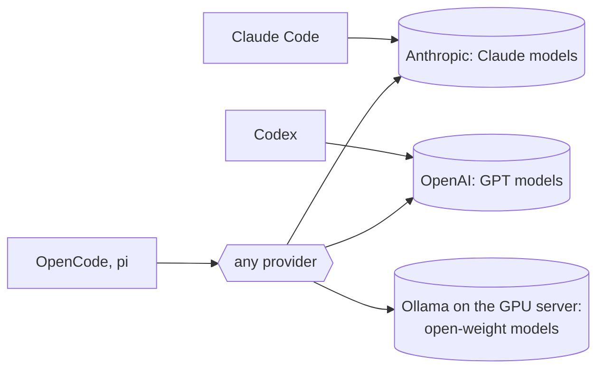

# Models

The [harness](harnesses.md) runs the loop; the **model** does the thinking. The two are separate decisions. A harness usually ties you to one vendor's models, so in practice "which harness" and "which model" are chosen together, but it helps to keep them apart when comparing results or planning for local inference.



## Hosted models we use

### Claude (Anthropic) via Claude Code

Our default. Claude Code is Anthropic's harness and runs the current Claude models. We use it both in the terminal and through the VS Code extension.

- Website and docs: [code.claude.com](https://code.claude.com/docs/en/setup)
- Account: any paid Claude subscription (Pro, Max, Team, Enterprise) or a Console account. No API key needed for the CLI or the extension.

=== "CLI"

    ```bash
    curl -fsSL https://claude.ai/install.sh | bash
    claude   # run inside a git repository, log in when prompted
    ```

=== "VS Code extension"

    1. Open the Extensions view (++ctrl+shift+x++), search for **Claude Code** (publisher Anthropic, id `anthropic.claude-code`), click **Install**.
    2. Click the Spark icon in the editor toolbar to open the panel and sign in.
    3. Optional: the extension bundles its own CLI for the chat panel. To run `claude` in the integrated terminal as well, install the CLI too.

    The extension adds inline diffs with accept or reject, `@`-mentions of files and selected line ranges, plan review before edits, and conversation history. Docs: [Claude Code in VS Code](https://code.claude.com/docs/en/vs-code).

Inside a session, `/model` switches between the available Claude models.

### OpenAI models via Codex

Codex is OpenAI's harness. We use it for second opinions, comparisons and tasks where a different model family might do better.

- Website and docs: [Codex CLI](https://learn.chatgpt.com/docs/codex/cli#getting-started) and [Codex IDE extension](https://learn.chatgpt.com/docs/codex/ide)
- Account: an OpenAI account with Codex access.

=== "CLI"

    ```bash
    curl -fsSL https://chatgpt.com/codex/install.sh | sh
    codex    # log in when prompted
    ```

=== "VS Code extension"

    1. Open the Extensions view (++ctrl+shift+x++), search for **Codex** by OpenAI, click **Install**. Also works in Cursor and Windsurf.
    2. Sign in from the Codex sidebar.

    The extension references open files and selections in the composer, shows focused diffs beside the source for accept or decline, and can hand a task off to Codex on the web while keeping the chat.

Both harnesses read the same project instruction file if you follow the [AGENTS.md symlink setup](instruction-files.md).

## Plans and billing

We do not pay per token. Both hosted vendors are used through subscription plans, which makes the cost predictable and removes the temptation to skimp on context or on the strongest model:

| Plan | Used for | Why |
|------|----------|-----|
| Claude Max (Anthropic) | Claude Code in the terminal and in VS Code, all daily agentic work | Highest usage limits for the harness we run most; the strongest models for design and hard bugs |
| ChatGPT plan (OpenAI), standard tier | Codex as a cheap second reviewer; image and 3D graphics generation | Independent second opinion on designs and diffs; image generation for figures, slides and 3D assets, which Claude does not offer |

API keys with per-token billing are kept only for automation that cannot run under a subscription, such as scheduled cloud agents. When a session hits a plan limit, `quota-axi` shows the remaining budget per vendor, see [orchestration](orchestration.md).

## Local models

We do **not** currently use local language models for agentic coding. We do have the infrastructure:

- A GPU server running PyTorch and PyTorch Lightning inside Docker, used mainly for image analysis in digital pathology.
- [Ollama](https://ollama.com/) installed on the same server for serving open models.

Ollama exposes an OpenAI-compatible API on `http://localhost:11434/v1`, which is what harnesses such as OpenCode and pi need to talk to a local model.

```bash
ollama pull <model>        # download
ollama run <model>         # interactive chat
ollama serve               # start the API server if it is not running
```

We experimented with local chatbots some time ago. The models were not good enough for agentic coding at the time; the situation has changed with the open-weight releases below, so this is worth revisiting.

## Open-weight models we want to try

Two open-weight releases in 2026 are close to frontier quality on coding and agentic benchmarks. Both are far too large for our GPU server to run at full size, so the realistic path is a hosted API or a smaller variant.

| Model | Vendor | Size | License and weights | Notes |
|-------|--------|------|---------------------|-------|
| [DeepSeek V4 Pro](https://api-docs.deepseek.com/news/news260424/) | DeepSeek | 1.6T total, 49B active (MoE) | MIT, weights public | Top open-weight model on agentic coding evaluations at release. A smaller **V4 Flash** (284B total, 13B active) exists. |
| [Kimi K3](https://github.com/MoonshotAI/Kimi-K3) | Moonshot AI | 2.8T total (MoE), 1M token context | Open weights released July 2026 | Native multimodal, leads front-end coding arenas. Largest open-weight model available. |

What to evaluate, in order:

1. **Via API.** Point OpenCode or pi at the vendor's API and run the same task through Claude Code, Codex and the open model. Compare diffs and cost.
2. **V4 Flash locally.** If it fits the GPU server in quantised form, serve it through Ollama and repeat the comparison with data staying on premises.
3. **Full-size models** only if a hosting provider or hardware upgrade makes sense for privacy reasons.

Record results on this page so the next person does not repeat the experiment.

## Choosing a model per task

| Task | Model class | Why |
|------|-------------|-----|
| Design, architecture, hard bugs | Strongest available (current Claude flagship) | Errors here are expensive |
| Implementation from an approved plan | Strong mid-tier | Plan constrains the work |
| Search, summarising, code review passes | Fast and cheap | Volume matters more than depth |
| Second opinion on a design or diff | A different vendor's model | Independent failure modes |
| Sensitive data that must not leave the server | Local open-weight | Only option |

Orchestration tools such as `quota-axi` help enforce these choices across several running agents. See [orchestration](orchestration.md).
