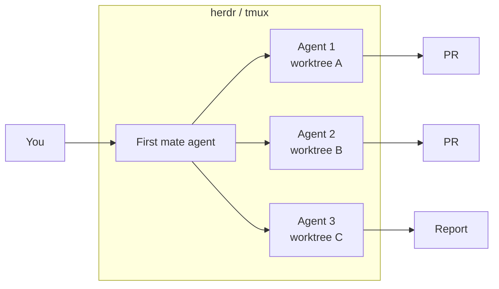

# Orchestration

One agent in one terminal is the starting point. Most of the leverage comes from running several agents at once, keeping them running when you are not at the keyboard, and giving each one an isolated workspace so they do not step on each other. That is orchestration.

## Building blocks

### Git worktrees

A worktree is a second checkout of the same repository in another directory, on its own branch. Every parallel agent gets its own worktree, so two agents editing the same file cannot conflict until merge time.

```bash
git worktree add ../myproject-feature-x -b feature-x
cd ../myproject-feature-x && claude
```

The `superpowers` `using-git-worktrees` skill automates this. Claude Code can also create worktrees for subagents directly.

!!! note
    The README mentions **treehouse** as a worktree helper. It is not yet documented here; see [open questions](../open-questions.md#tools-mentioned-but-not-yet-evaluated).

### Subagents

The main agent can spawn a subagent for a bounded task: search the codebase, write one module, review a diff. The subagent's tool output stays out of the parent's context, which keeps the parent's window small. Use them for anything that would otherwise dump a lot of text into the conversation.

### tmux

[tmux](https://github.com/tmux/tmux) keeps agent sessions alive when your terminal closes and lets you tile several sessions on one screen. A minimal workflow: one tmux window per worktree, one agent per window.

```bash
tmux new -s agents
# Ctrl-b c   new window,   Ctrl-b n   next window,   Ctrl-b d   detach
```

## Persistent agents: herdr

[herdr](https://herdr.dev/) is a runtime that keeps coding agents (Claude Code, Codex, Cursor and others) running persistently in the background, across projects and machines, even when you close the laptop or lose the network. Your existing agent CLIs run unchanged inside it.

```bash
curl -fsSL https://herdr.dev/install.sh | sh
```

Use it instead of tmux when agents need to outlive your laptop session, or when you drive agents from more than one machine.

## A crew of agents: firstmate

[firstmate](https://github.com/kunchenguid/firstmate) turns one agent into a "first mate" that dispatches work to a crew of agents running in isolated git worktrees, supervises them, and collects finished pull requests or investigation reports. It is not a new harness; it is a directory of instructions, skills and tooling that any supported harness (Claude Code, Codex, OpenCode, pi, Cursor) can load.

```bash
gh auth login
git clone https://github.com/kunchenguid/firstmate
cd firstmate
claude   # or another supported harness
```

Then talk to the first mate in plain language:

> look at my github project xyz, then fix the flaky login test and add dark mode

The pattern to internalise: **you talk to one agent, it manages the rest**. Combined with herdr for persistence, this is how we run multi-task work.

## Quota awareness: quota-axi

Running several agents burns through model quota quickly. [quota-axi](https://axi.md/) tracks local Claude, Copilot and Cursor quota so an orchestrating agent can decide which model to use for which task, and stop before hitting a limit.

```bash
npx -y quota-axi
```

Configure the models each agent may use so that cheap, fast models handle search and review and the strongest model handles design and hard bugs.

## Remote connections

Agents run where the code and the compute are, which is usually a server, not the laptop. Three ways to reach a running session:

- **ssh and tmux.** Start the agent inside a tmux session on the server. Detach, close the laptop, reconnect later from any machine with `ssh server -t tmux attach -t agents`. This is the minimal setup and needs nothing but ssh.
- **herdr.** Sessions live in herdr's runtime and are reachable from any of your machines through its interface, no tmux bookkeeping. Prefer it once you run more than a couple of agents or switch machines often.
- **Claude Code on the web and remote control.** A session started on the web or in the terminal can be resumed from VS Code or from the phone, so you can answer a question the agent has or check progress without a terminal. Sign in with the subscription account, not the API console, for this to work.

Whatever the transport, the state that matters lives in the repository: the plan file, the branch, the commits. If the connection is lost, the work is not.

## Overnight runs

Long test suites, large refactors, migrations and multi-step plans do not need you watching. The pattern we call *good night, have fun*:

1. **Brainstorm during the day.** Go through the [development loop](../best-practices/index.md) up to the approved plan. The plan file has ordered steps, the files each step touches, and how each step is verified. This is the part that needs you.
2. **Start the run in the evening.** On the server, in herdr or tmux, in a fresh worktree: `claude` with the instruction "execute the plan in `docs/superpowers/plans/<plan>.md`, run the full test suite after every step, fix failures, commit each step, do not push". Long-running tests and builds are what the night is for.
3. **Check in the morning.** Read the report and the diff. Run the tests once more yourself. Open the pull request, or send the agent back with the review comments.

The plan file is what makes this safe: the agent has a written definition of done, and you have something to check the result against. The branch protection ([repository policies](../best-practices/repository-policies.md)) guarantees that nothing reaches `main` without the checks and your review, so the worst case of a bad night is a branch you delete.

## Feedback surfaces: lavish

[lavish-axi](https://axi.md/) gives agents a *human review surface*: the agent generates HTML (a report, a screenshot diff, a preview) and you give feedback directly in the browser. This closes the loop for UI work and for reviewing long outputs without reading raw terminal text.

!!! note "No-mistakes pipeline"
    The README lists a "no-mistakes pipeline" alongside lavish. The idea is a fixed sequence of automated checks (lint, tests, build, review agent) that every agent change passes before a human looks at it. The concrete implementation is not documented yet; see [open questions](../open-questions.md#tools-mentioned-but-not-yet-evaluated).

## Putting it together



- **herdr or tmux** keeps everything alive.
- **firstmate** (or your own dispatching agent) hands out tasks.
- **worktrees** isolate each task.
- **quota-axi** picks affordable models.
- **lavish** and pull requests bring results back to you for review.
