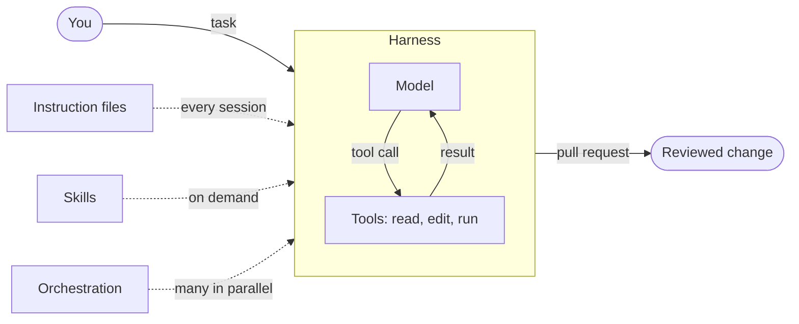

# Agentic Workflows

This site documents how we work with coding agents: the tools we run, the files that steer them, the skills we install, and the practices that make the results trustworthy. It is written as an onboarding resource. Read it top to bottom on your first day, then come back to individual pages as reference.

## What "agentic coding" means here

An agent is a language model wrapped in a loop that can read files, run commands, and edit code until a task is done. The model is only one part of the system. The rest is what we control:

- the **harness** that runs the loop (Claude Code, Codex, OpenCode, pi),
- the **instruction files** that tell the agent how we work (`CLAUDE.md`, `AGENTS.md`),
- the **skills** that package repeatable procedures (planning, TDD, debugging, review),
- the **orchestration** that keeps several agents working in parallel and overnight,
- the **practices** that keep the context window small and the output correct.

Good results come from getting these five pieces right, not from clever prompts.

## Learning path

-   :lucide-rocket:{ .lg .middle } **1. Getting started**

    ---

    Install a harness, wire up the global instruction file, install the plugins, and run your first session.

    [:octicons-arrow-right-24: Getting started](getting-started.md)

-   :lucide-book-open:{ .lg .middle } **2. Concepts**

    ---

    Harnesses, instruction files, skills, and orchestration. What each one is for and how they fit together.

    [:octicons-arrow-right-24: Harnesses](concepts/harnesses.md)

-   :lucide-check-check:{ .lg .middle } **3. Best practices**

    ---

    The development loop we follow, how to manage context and tokens, and the engineering standards every agent must meet.

    [:octicons-arrow-right-24: The development loop](best-practices/index.md)

-   :lucide-wrench:{ .lg .middle } **4. Tooling and resources**

    ---

    Editor integration, voice input, token-saving CLIs, and courses and videos worth your time.

    [:octicons-arrow-right-24: Tooling](tooling.md)

## The short version

If you only remember five things:

1. Put your standing instructions in one `AGENTS.md`, symlinked as `CLAUDE.md`. See [instruction files](concepts/instruction-files.md).
2. Install the `superpowers` plugin and let it drive brainstorming, planning, TDD and review. See [skills](concepts/skills.md).
3. Start every new task with `/clear`. Context is the scarcest resource. See [token maxing](best-practices/context-management.md).
4. Never accept "done" without a reproduced bug, a passing test, or a build log. See [engineering standards](best-practices/engineering-standards.md).
5. Run independent tasks in parallel in git worktrees, and long test runs overnight. See [orchestration](concepts/orchestration.md).
