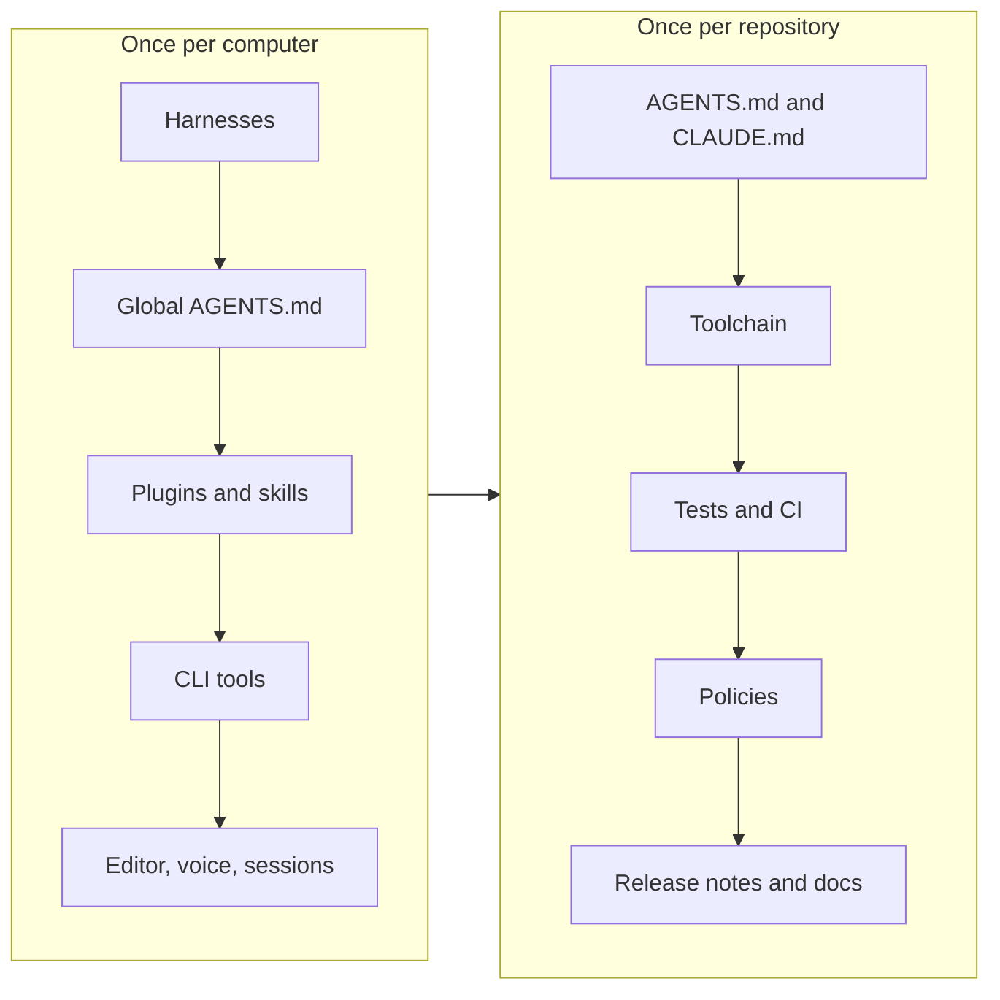

# Setup checklist

Everything to install, on one page. The first part is done once per computer, the second once per repository. Each item links to the page that explains it; this page only says what to install and the command to do it.



## On your computer

### Harnesses

| Install | Command | Page |
|---------|---------|------|
| Claude Code | `curl -fsSL https://claude.ai/install.sh \| bash` | [Harnesses](concepts/harnesses.md) |
| Codex CLI | `curl -fsSL https://chatgpt.com/codex/install.sh \| sh` | [Harnesses](concepts/harnesses.md) |
| OpenCode, pi (optional) | see [opencode.ai](https://opencode.ai/), [pi.dev](https://pi.dev/docs/latest) | [Harnesses](concepts/harnesses.md) |
| VS Code extensions | Extensions view, search **Claude Code** (Anthropic) and **Codex** (OpenAI) | [Models](concepts/models.md) |

Sign in with the subscription accounts (Claude Max, ChatGPT plan), not with API keys. See [plans and billing](concepts/models.md#plans-and-billing).

### Global instruction file

```bash
# ~/AGENTS.md holds the rules for every project; start from the template
ln -s ~/AGENTS.md ~/.claude/CLAUDE.md
```

Template and rules: [CLAUDE.md and AGENTS.md](concepts/instruction-files.md).

### Plugins and skills

```bash
claude plugin install superpowers@claude-plugins-official   # brainstorming, plans, TDD, debugging, review
claude plugin install humanizer@humanizer                    # natural prose
npx skills add JuliusBrussee/caveman -g                      # terse responses, optional
```

What each does: [Skills](concepts/skills.md).

### Command line tools

| Install | Command | Purpose |
|---------|---------|---------|
| [uv](https://docs.astral.sh/uv/) | `curl -LsSf https://astral.sh/uv/install.sh \| sh` | Python environments, `uv run`, `uvx` |
| [GitHub CLI](https://cli.github.com) | package manager, then `gh auth login` | pull requests, rulesets, releases |
| Node.js | package manager | needed for `npx` tools below |
| [gh-axi](https://axi.md/) | `npx -y gh-axi` | GitHub for agents, token efficient |
| [chrome-devtools-axi](https://axi.md/) | `npx -y chrome-devtools-axi` | browser automation for agents |
| [quota-axi](https://axi.md/) | `npx -y quota-axi` | plan quota per vendor |
| [rtk](https://github.com/rtk-ai/rtk) (evaluating) | see repository, then `rtk init -g` | compress command output |

Why these: [Token maxing](best-practices/context-management.md).

### Editor, voice, sessions

| Install | Command | Page |
|---------|---------|------|
| tmux | package manager | [Orchestration](concepts/orchestration.md) |
| [herdr](https://herdr.dev/) | `curl -fsSL https://herdr.dev/install.sh \| sh` | [Orchestration](concepts/orchestration.md) |
| [firstmate](https://github.com/kunchenguid/firstmate) | `git clone https://github.com/kunchenguid/firstmate` | [Orchestration](concepts/orchestration.md) |
| [OpenSuperWhisper](https://github.com/Starmel/OpenSuperWhisper) (macOS) | `brew install opensuperwhisper` | [Tooling](tooling.md#voice) |
| [text2speech](https://github.com/matthiaskoenig/text2speech) (GPU server) | `git clone` then `uv sync` | [Tooling](tooling.md#voice) |

### Computer checklist

- [ ] Claude Code and Codex installed and signed in
- [ ] VS Code extensions installed
- [ ] `~/AGENTS.md` written and symlinked to `~/.claude/CLAUDE.md`
- [ ] `superpowers` and `humanizer` installed
- [ ] `uv`, `gh` (authenticated), Node.js
- [ ] tmux or herdr for sessions that outlive the terminal

## In a repository

Copy files from the reference repository [sbmlutils](https://github.com/matthiaskoenig/sbmlutils) or from this one, then adjust names. The order is the one of [Onboarding a repository](onboarding-repository.md).

### Instruction files

```bash
ln -s AGENTS.md CLAUDE.md
echo CLAUDE.local.md >> .gitignore
```

### Toolchain (Python)

| File | Content | Page |
|------|---------|------|
| `pyproject.toml` | project metadata, `dev` dependency group with `pytest`, `ruff`, `ty`, `pre-commit`, `tox`, `zensical`; `[tool.ty]` | [Python code](best-practices/python.md) |
| `.python-version` | the Python version uv installs | |
| `.ruff.toml` | lint and format configuration | [Python code](best-practices/python.md) |
| `.pre-commit-config.yaml` | ruff, ty and hygiene hooks | [Python code](best-practices/python.md) |
| `tox.ini` | test matrix and `ty` environment | [Python code](best-practices/python.md) |
| `uv.lock` | generated by `uv sync`, committed | |

```bash
uv sync --extra dev          # or `uv sync` when the tools are a dependency group
uv run pre-commit install
```

Data models are pydantic models with validation.

### Tests and continuous integration

| File | Job name | Content |
|------|----------|---------|
| `.github/workflows/ci-cd.yml` | `tests` | pytest matrix, aggregated into one job |
| `.github/workflows/ruff.yml` | `ruff` | `ruff check`, `ruff format --check` |
| `.github/workflows/ty.yml` | `ty` | `ty check` |
| `.github/workflows/docs.yml` | `build` or `docs` | zensical build, deploy from the default branch |

For a small repository the checks can share one workflow with named jobs, as `tests.yml` in this repository does.

### Policies

| File | Content |
|------|---------|
| `.github/CODEOWNERS` | `* @matthiaskoenig` |
| `.github/rulesets/main.json` | pull request required, the checks above, linear history, no bypass |
| `.github/rulesets/develop.json`, `tags.json` | libraries with a `develop` branch and releases |
| `.github/rulesets/apply.sh` | applies rulesets and merge settings, idempotent |

```bash
.github/rulesets/apply.sh owner/repo
```

Details: [Repository policies](best-practices/repository-policies.md).

### Release notes and documentation

| File | Content |
|------|---------|
| `release-notes/<version>.md` | one note per tagged release |
| `.github/workflows/release.yml` | GitHub release from the note on a version tag |
| `zensical.toml`, `docs/` | the documentation site with a development page |
| `tests/test_docs.py` | strict build and writing-rule checks of the docs (copy from this repository) |

### Repository checklist

- [ ] `AGENTS.md` written, `CLAUDE.md` symlinked, `/context` shows it
- [ ] `pyproject.toml`, `.ruff.toml`, `[tool.ty]`, `.pre-commit-config.yaml`, `tox.ini`
- [ ] tests green, `uv run pytest`
- [ ] workflows with named jobs run on pull requests
- [ ] `CODEOWNERS` and rulesets applied
- [ ] `release-notes/` with the baseline note, tag pushed
- [ ] docs site builds
